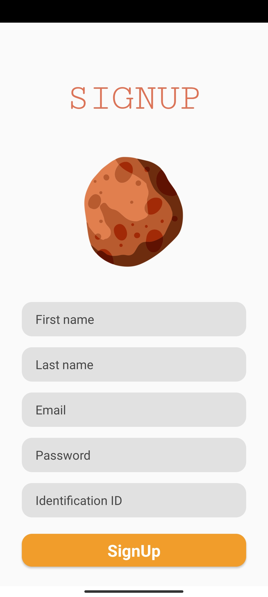
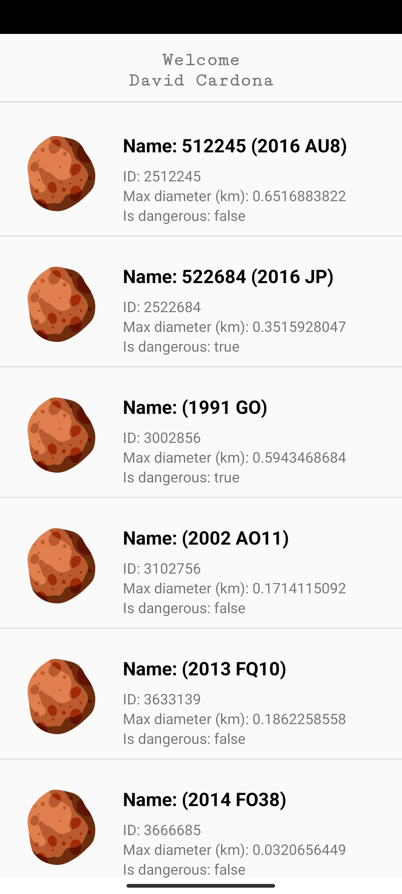

```
- David José Cardona Nieves
```

<!-- TABLE OF CONTENTS -->
<details>
  <summary>Tabla de Contenido</summary>
  <ol>
    <li>
      <a href="#sobre-el-proyecto">Sobre el Proyecto</a>
      <ul>
        <li><a href="#estructura">Estructura</a></li>
      </ul>
    </li>
    <li>
      <a href="#primeros-pasos">Primeros pasos</a>
      <ul>
        <li><a href="#prerrequisitos">Prerrequisitos</a></li>
        <li><a href="#clonar-el-repositorio">Clonar el repositorio</a></li>
        <li><a href="#ejecutar-la-aplicación">Ejecutar la aplicación</a></li>
      </ul>
    </li>
    <li><a href="#utilización">Utilización</a></li>
    <li><a href="#planeación">Planeación</a></li>
    <li><a href="#licencia">Licencia</a></li>
    <li><a href="#contacto">Contacto</a></li>
  </ol>
</details>


<!-- ABOUT THE PROJECT -->
## Sobre el Proyecto

Este proyecto es una implementación de una aplicación móvil para el consumo de la API NeoWs de la NASA ([api.nasa.gov](https://api.nasa.gov/)).

Requisitos:
* [x] La aplicación debe poder instalarse en la versión de Android 6.0 Marshmallow o posterior.
* [x] La aplicación debe tener registro de usuarios, inicio y cierre de sesión.
* [x] Se deben almacenar todos los datos en una base de datos local (SQLite).
* [x] Debe tener mínimo 4 ventanas.
* [x] Listar los datos de la tabla Asteroids en la ventana principal luego de presionar un botón que descargue los datos de la API.
* [x] Al seleccionar un ítem del listado de asteroides, se debe navegar a una ventana que muestre toda la información.
* [x] Los registros de asteroides que se listan en la página principal deben corresponder sólo al usuario que ha iniciado sesión. 
* [x] Utilizar Git como control de versiones y cargar el proyecto a un repositorio público en Github/GitLab. 
* [x] Generar la documentación del proyecto (README.md) especificando lenguaje de programación, base de datos utilizada, librerías utilizadas, Información de la API y si es necesario una guía de uso de la aplicación incluyendo capturas de pant

El sistema ha sido probado en un dispositivo Poco X3 Pro que corre bajo Android 12 (MIUI 13).

### Estructura

Este proyecto se construyó utilizando las siguientes herramientas/bibliotecas:

* [Material Components](https://github.com/material-components/material-components-android/releases/tag/1.8.0)
* [Retrofit](https://github.com/square/retrofit/releases/tag/2.9.0)
* [RecyclerView](https://developer.android.com/jetpack/androidx/releases/recyclerview?hl=es-419#1.3.0)
* [Gson](https://github.com/google/gson/releases/tag/gson-parent-2.9.0)
* [Room](https://developer.android.com/jetpack/androidx/releases/room?hl=es-419#2.5.1)
* [Stetho](https://github.com/facebookarchive/stetho/releases/tag/v1.5.1)
* [CircleImageView](https://github.com/hdodenhof/CircleImageView/releases/tag/v3.1.0)

### Endpoints de la API

Obtener todos los Objetos Cercanos a la Tierra (NEO) en un intervalo de fechas:

```
GET https://api.nasa.gov/neo/rest/v1/feed?start_date=START_DATE&end_date=END_DATE&api_key=API_KEY
```

| Parametro     | Tipo                   | Description                                       |
| :--------     | :----------------------| :-------------------------------------------------|
| `api_key`     | `string`               | **Default:** "DEMO_KEY" (30 peticiones/hora)      |
| `start_date`  | `string (date format)` | **Default:** "2023-04-28" (fecha de la entrevista) |
| `end_date`    | `string (date format)` | **Default:** "2023-04-28" (fecha de la entrevista) |

<!-- GETTING STARTED -->
## Primeros pasos

### Prerrequisitos

* **Sistema operativo:** Android Studio está disponible para Windows, macOS y Linux. Para utilizar Android Studio, necesitarás un sistema operativo compatible y actualizado.
* **Hardware:** Tu ordenador debe tener al menos 8 GB de RAM, 2 GB de espacio libre en disco y un procesador con al menos cuatro núcleos.
* **Java Development Kit (JDK):** Android Studio requiere que tengas Java 8 JDK o superior instalado en tu sistema para compilar aplicaciones Android.
* **Android SDK:** Android Studio también requiere que descargues e instales las herramientas de desarrollo Android SDK para compilar aplicaciones Android. Esto incluye el SDK de Android, herramientas de compilación, imágenes del sistema y otros recursos necesarios para compilar y probar tu aplicación.
* **Dispositivo Android o emulador:** Para probar y ejecutar tu aplicación, necesitarás un dispositivo Android conectado a tu ordenador o un emulador Android configurado en Android Studio.

### Clonar el repositorio

En primer lugar, es necesario clonar el repositorio de GitHub. Para ello, puedes abrir un terminal y ejecutar el siguiente comando:

```
git clone https://github.com/DavidLakeT/lumos.git
```

### Ejecutar la aplicación

Una vez obtenida la clave de la API en [api.nasa.gov](https://api.nasa.gov/), puedes consultar el tutorial [Cómo crear y ejecutar tu app](https://developer.android.com/studio/run?hl=es-419) del equipo de desarrolladores de Google.

La APIKey debe establecerse en el archivo app/res/raw/config.properties.

<!-- USAGE EXAMPLES -->
## Utilización

La aplicación ofrece al usuario la posibilidad de registrarse introduciendo información como nombre, apellidos, DNI y otros. También presenta la funcionalidad de iniciar sesión. 
Cuando cualquiera de estas opciones se realiza correctamente, al usuario se le presenta una vista de la lista de asteroides construida con la información adquirida de la API.

Si el usuario desea consultar la información con más detalle, puede hacer clic en cualquier asteroide de la lista y acceder a un menú con información más precisa.

### Inicio de sesión


### Registro



### Lista de asteroides



### Información de asteroide


<!-- ROADMAP -->
## Planeación

He aquí algunos aspectos que podrían considerarse para una futura implementación del proyecto:

- [ ] Posibilidad de filtrar asteroides (por tamaño, nombre, velocidad, etc.)
- [ ] Interfaz de usuario en modo oscuro
- [ ] Encriptación de la contraseña
- [ ] Soporte multi-idioma
    - [ ] Español
    - [x] Inglés

Si tienes alguna recomendación, puedes crear un issue ([aquí](https://github.com/DavidLakeT/lumos/issues)) especificando lo que planteas y dar pie al debate sobre la idea.

<!-- LICENSE -->
## Licencia

Distribuido bajo la licencia MIT. Consulte `LICENSE.txt` para más información.

<!-- CONTACT -->
## Contacto

David Cardona - [Instagram](https://www.instagram.com/whatdavedoes/) - [Linkedin](https://www.linkedin.com/in/davidlaket/) - djcardonan@eafit.edu.co

Link del proyecto: [https://github.com/DavidLakeT/lumos](https://github.com/DavidLakeT/lumos)
