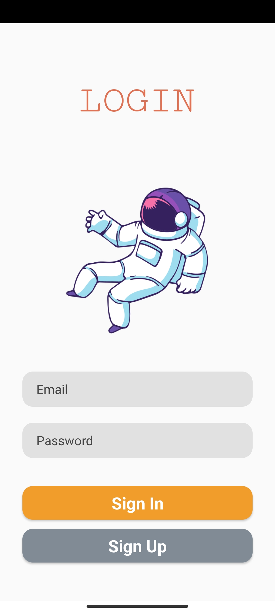
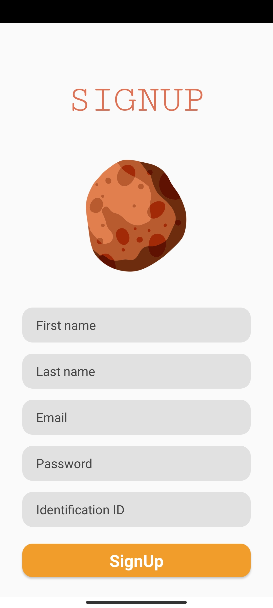
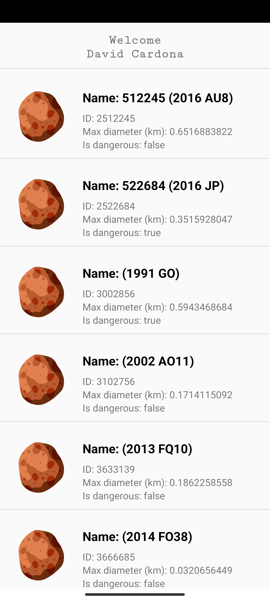
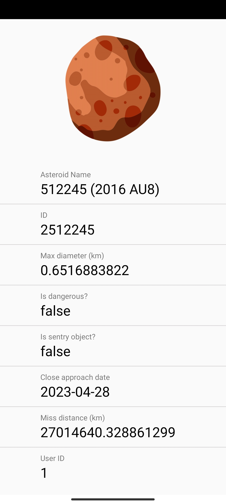

```
- David José Cardona Nieves
```

<!-- TABLE OF CONTENTS -->
<details>
  <summary>Table of Contents</summary>
  <ol>
    <li>
      <a href="#about-the-project">About The Project</a>
      <ul>
        <li><a href="#built-with">Built With</a></li>
      </ul>
    </li>
    <li>
      <a href="#getting-started">Getting Started</a>
      <ul>
        <li><a href="#prerequisites">Prerequisites</a></li>
        <li><a href="#clone-the-repository">Clone the repository</a></li>
        <li><a href="#running-the-app">Running the app</a></li>
      </ul>
    </li>
    <li><a href="#usage">Usage</a></li>
    <li><a href="#roadmap">Roadmap</a></li>
    <li><a href="#license">License</a></li>
    <li><a href="#contact">Contact</a></li>
  </ol>
</details>


<!-- ABOUT THE PROJECT -->
## About The Project

This project is an implementation of a mobile application for the consumption of NASA's NeoWs API ([api.nasa.gov](https://api.nasa.gov/)).

Requirements:
* [x] The application must be able to be installed on Android version 6.0 Marshmallow or later.
* [x] The application must have user registration, login and logout.
* [x] All data must be stored in a local database (SQLite). 4. It must have a minimum of 4 windows.
* [x] List the data from the Asteroids table in the main window after pressing a button that downloads the data from the API.
* [x] When selecting an item from the asteroids list, navigate to a window that shows all the information.
* [x] The asteroid records listed on the main page should correspond only to the logged-in user.
* [x] Use Git as version control and upload the project to a public repository in GitLab.
* [x] Generate project documentation (README.md) specifying programming language, database used, libraries used, API information, libraries used, API information and if necessary a user guide of the application including screenshots.

The system has been tested on Poco X3 Pro device running Android 12 (MIUI 13).

### Built With

This project was built using the following tools/libraries:

* [Material Components](https://github.com/material-components/material-components-android/releases/tag/1.8.0)
* [Retrofit](https://github.com/square/retrofit/releases/tag/2.9.0)
* [RecyclerView](https://developer.android.com/jetpack/androidx/releases/recyclerview?hl=es-419#1.3.0)
* [Gson](https://github.com/google/gson/releases/tag/gson-parent-2.9.0)
* [Room](https://developer.android.com/jetpack/androidx/releases/room?hl=es-419#2.5.1)
* [Stetho](https://github.com/facebookarchive/stetho/releases/tag/v1.5.1)
* [CircleImageView](https://github.com/hdodenhof/CircleImageView/releases/tag/v3.1.0)

<!-- GETTING STARTED -->
## Getting Started

### Prerequisites

* **Operating system:** Android Studio is available for Windows, macOS and Linux. To use Android Studio, you will need a compatible and up-to-date operating system.
* **Hardware:** Your computer should have at least 8 GB of RAM, 2 GB of free disk space and a processor with at least four cores.
* **Java Development Kit (JDK):** Android Studio requires that you have Java 8 JDK or higher installed on your system to compile Android applications.
* **Android SDK:** Android Studio also requires that you download and install the Android SDK development tools to build Android applications. This includes the Android SDK, build tools, system images, and other resources needed to build and test your application.
* **Android device or emulator:** To test and run your application, you will need an Android device connected to your computer or an Android emulator configured in Android Studio.

### Clone the repository

First, you need to clone the repository from GitHub. To do this, you can open a terminal and run the following command:

```
git clone https://github.com/DavidLakeT/lumos.git
```

### Running the app

After you've got your API Key at [api.nasa.gov](https://api.nasa.gov/) you can check the [How to create and run your app tutorial](https://developer.android.com/studio/run?hl=es-419) by Google Developers team.

The APIKey must be set on the app/res/raw/config.properties file.


<!-- USAGE EXAMPLES -->
## Usage

### Login Screen



### Signup Screen



### Asteroid List



### Asteroid Info



<!-- ROADMAP -->
## Roadmap

Here are some aspects that could be considered for future implementation of the project:

- [ ] Possibility to filter asteroids (by size, name, velocity, etc.)
- [ ] Dark mode UI
- [ ] Password encryption
- [ ] Multi-language Support
    - [ ] Spanish
    - [x] English

If you have any recommendations, you can create an issue ([here](https://github.com/DavidLakeT/lumos/issues)) specifying what you are raising and give rise to debate on the idea.

<!-- LICENSE -->
## License

Distributed under the MIT License. See `LICENSE.txt` for more information.

<!-- CONTACT -->
## Contact

David Cardona - [Instagram](https://www.instagram.com/whatdavedoes/) - [Linkedin](https://www.linkedin.com/in/davidlaket/) - djcardonan@eafit.edu.co

Project Link: [https://github.com/DavidLakeT/lumos](https://github.com/DavidLakeT/lumos)
